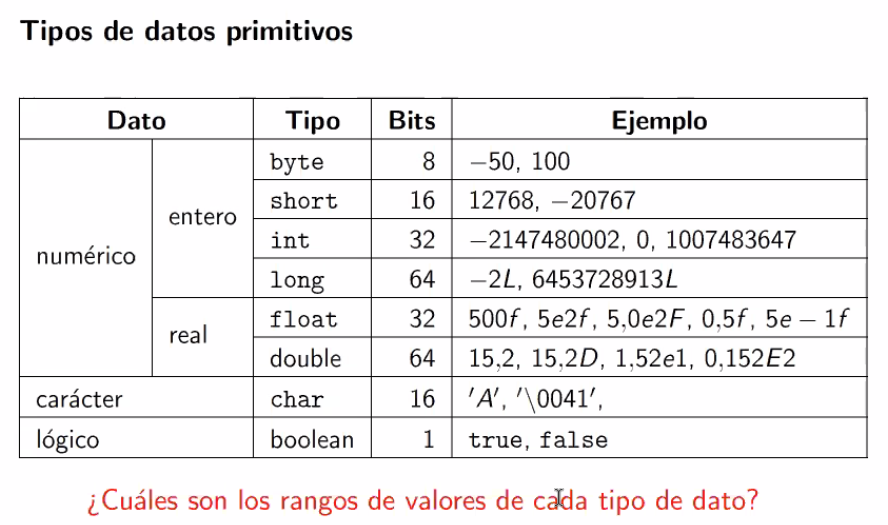
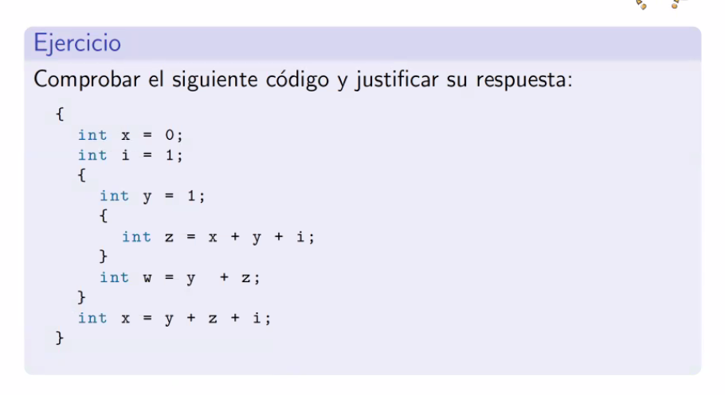
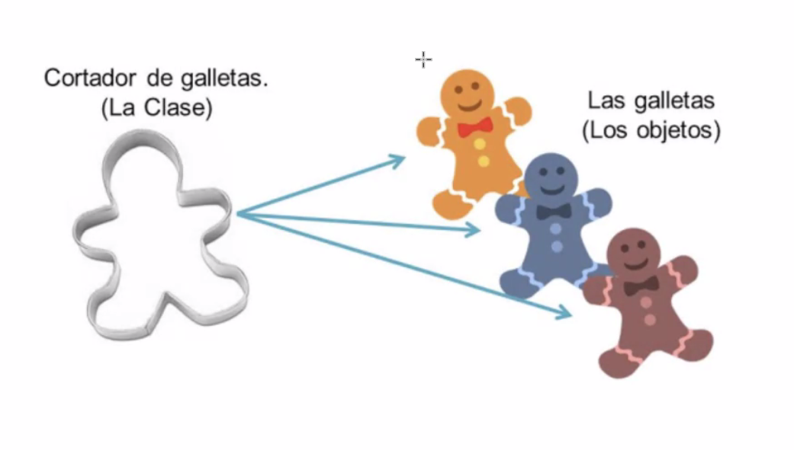
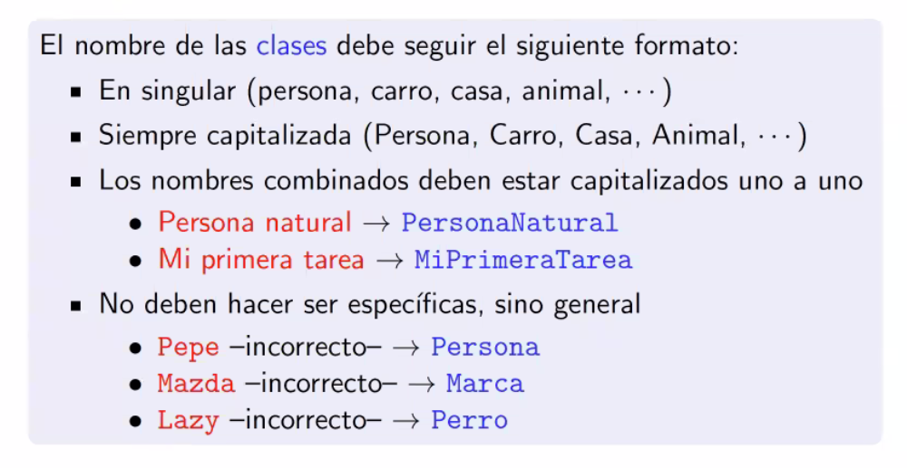
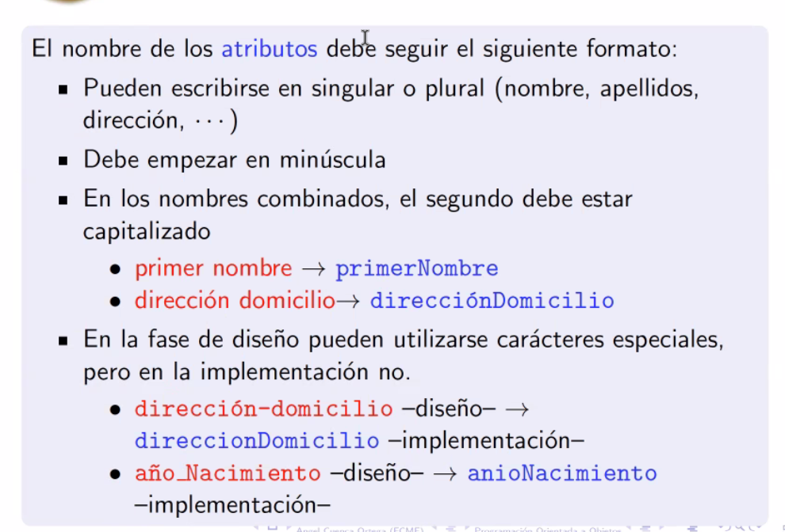
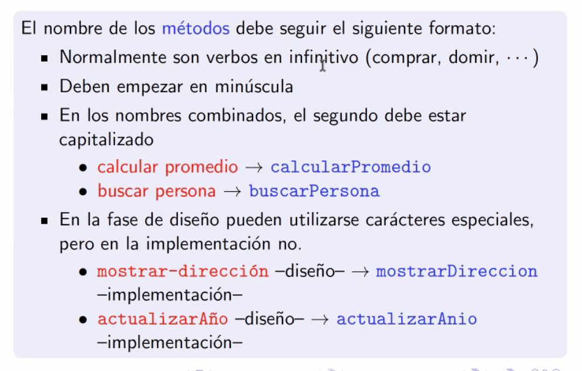
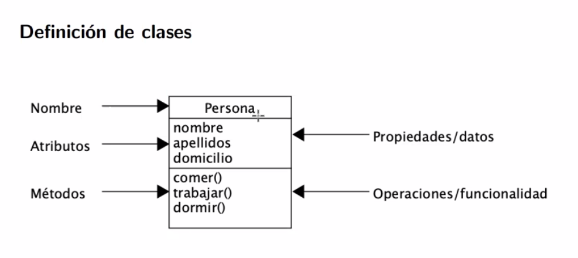
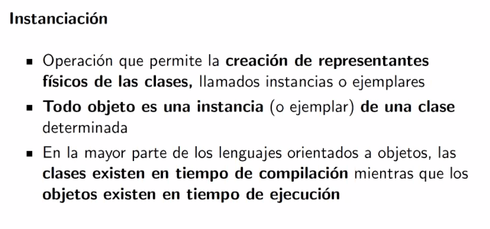
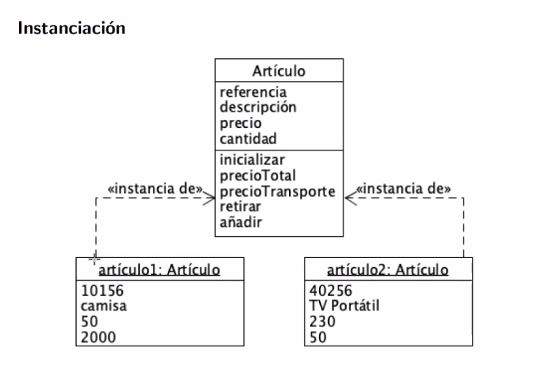
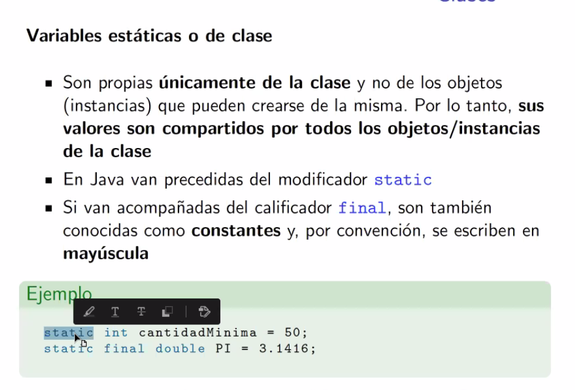

# NOTAS DE POO

### Twitter: **@andreescondo**

## NOTAS DE POO 3/12/2021
el metodo main es quien inicia cualquier programa java, estructura:

```
public static void main(String[] args){
};
```

args: el nombre del vector, puede tener cualquier nombre, standar args

solo una clase tiene el metodo main()

Para imprimir texto por consola

> System.out.println()

print **ln**: es la manera sintactica para hacer un salto de linea, puede ponerse sin el ln **print()**

Nota: El nombre de la clase principal debe ser el mismo que el del archivo

### Tipos de datos
**Datos primitivos**


String: *NO* es un dato primitivo, es un objeto

Los valores numericos si no se le asigna  un valor inicial, por defecto se inicia con 0

*VARIABLES y constantes*
siempre se inicia con 
``
tipo de dato + nombreVariable + [ = valorInicial]; 
``

Ejemplos
``
Datos primitivos
dobles
char
byte
boolean

Datos NO primitivos
String
Persona(custom object)
``


**IDENTIFICADORES VALIDOS - NO VALIDO**

**Validos**

guion medio (-)  
guion bajo (_)


**No validos**

espacios en blanco(' ') 
palabras reservadas (boolean, String,...)  
caracteres especiales (.)

**CONSTANTES**

Todo el nombre en Mayusculas

> **final** int CONSTANTE = *valor*

final: establece el tipo de dato como constante y es inmutable.

Declarar
> final int AGE;

Inicializar
> AGE = 32;

Declarar e inicializar
> final int AGE = 32;

**OPERADORES**
aritmeticos
logicos
relacionales


PREGUNTAS FINAL DE LA CLASE: 

unidad de compiacion - archivo con extension java.

archivo class: contiene el codigo maqina

maquina virtual: interpreta el byte code (.class) y ejecuta las instrucciones, traduce a al SO respectivo, dependiente del SO

bytecode: es idependiente de la maquina virtual

</br>
</br>

---

## NOTAS DE POO 8-12-2021

clases son el corazon de jva, contiene un conjunto de instrucciones.
el metodo principal es **main()**, solo deberia existir uno en todo el programa.

Unidad de compilacion es un programa java

**(participacion en clases, pregunta de incializacion de boolean - Bien respondido)**

---
````
Incializacion de variables
1. numerico : 0
2. boolean: false
3. character: null
````
---
### Sentencia
1. simples
2. compuestas

simples: las que son una linea y terminan en **;**

compuestas: las que estan enmarcadas en **{ }**

---
### Alcance


---

Formas de declarar una  _sentencia_

ej: de una intrucción:
````
if(n%2 == 4)
  System.out.printl('')
else
  System.out.printl('')

````

ej: mas una intrucción:
````
if(n%2 == 4){
  System.out.printl('')
  System.out.printl('')
  System.out.printl('')
} else {
  System.out.printl('')
  System.out.printl('')
}
````
### Iteraciones

1. while
2. do-while
3. for

---
Comentarios
sencillos : **//**
multiLinea: __/* */__

---

Deber: hacer un factorial de un numero con while, do-while, for

Para el dia viernes: 
1. Prioridad de operadores en java: Nombre. Simbolo. Paréntesis, Corchetes, Punto

2. vectores unidimencionales
    + declaracion y definicion
        En Java se declaran especificando el tipo de dato que almacenarán, el nombre y la identificación [] la cual determina que se trata de un vector.
        para inicializar las posiciones de un vector, es necesario asignar al vector declarado la palabra new más el tipo de dato y nuevamente [].

    + indices
    + asignacion, recorrido y recuperacion de valores


1+2-3*5 =12

</br>
</br>

---
## NOTAS DE POO 10-12-2021
  
  ### Vectores

    Preguntas bien respondidas:

    1. que es un vector: -Respondio bien

    2. preguntas de vectores sobre incremento y decremento(++)

    3. pregunta sobre vectores

    4. que es un funcion - bien respondido


  Parametros son los valores recibidos en una funcion. Argumentos son los valores enviados a la funcion.

  ````
    //parametros     <>
    int function(int a){
      return 0;
    }

    //argumentos          <>
    int result = function(10);
  ````

  Una funcion no puede ir dentro de una funcion, para usar static se tiene que poner con tipo de dato int

</br>
</br>

---

## NOTAS POO 15/12/2021

### Añadir comentarios si o si a las funciones

Uso de comentarios para añadir documentacion
```
/**
* //Titulo de que hace la clase 
* @params //adicion de parametros, que son y para que sirven
* @return // si la función retorna algo que es lo que retorna
*/
```
</br>
</br>

----

## NOTAS POO 22/12/2021

objeto es un entidad que debe tener datos que posee un estado, cambia a partir de una accción (método).

Una clase es una definicio, plantilla, molde que permite la creacion de objetos, y contiene la descripcion de las caracteristicas comunes de esos objetos

Componentes de una clase: </br>
Parte **dinámica**: Campos con nombres, **_atributos_**.
Parte **estáticos**: Procedimientos o funciones, **_métodos_**



</br>

### Regla para nombres de clases:






_Nota: Obligatorio_

Definición de clases





Todas las clases deben tener el mismo numero de atributos



Variable Estatica

